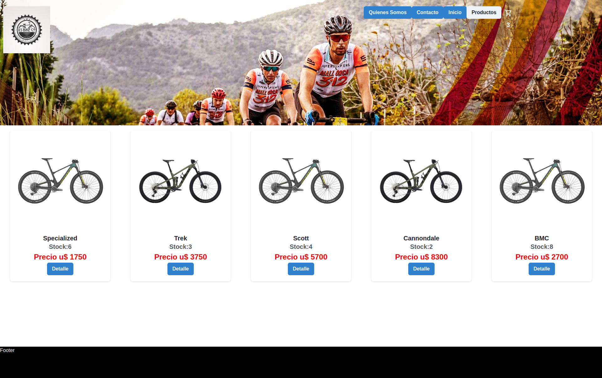

#### 2nda Preentrega tienda online US Bike

Proyecto de Single page de tienda eCommerce, al ingresar al sitio se renderiza un catalogo de los productos que se mostraran en tarjetas, a los cuales se accede haciendo click en detalle, donde tenemos mas informacion y una descripcion del producto, tambien podemos realizar la compra del mismo agregando al carrito.
 
**En la tienda renderizo:**

1. _Imagen_
1. _Nombre_
1. _Stock_
1. _Precio_
1. _Detalle_

La opcion de productos nos permite filtrar categorias, proximamente el filtrado tambien sera por marca de producto y precio.

**Desarrolados con: 

1. **ReactJS**
1. **Chakra**
1. **sweet alert**

### Desarrollado por:

_Ezequiel Lajmanovich_ 